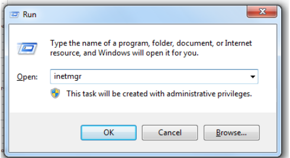
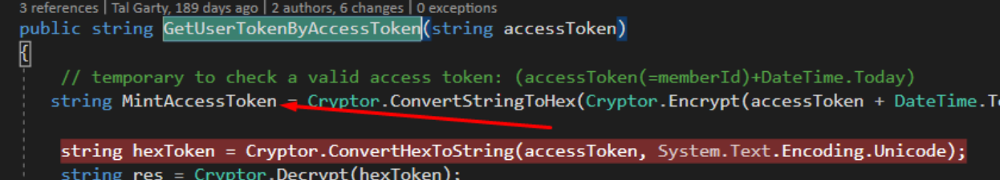

# Servers

Test: 172.29.90.100

Pre-Prod: 172.29.46.10

Production: 172.29.25.24.197-199

# Upload Client Version

- Delete build folder.
- Update version number inside index.html
- Build the project according to the desired environment:
  - Test: npm run build:dev.
  - Preprod: npm run build:preprod
  - Prod: npm run build:prod
- Connect to IIS Server and find the correct Site:
  - Test: node-server-beyahadWebClient
  - Pre-prod: Beyahad.
  - Prod: HistadrutWebClient.
- Find build-client folder and change its name to build + version, example:
  - build-1.0.60
- Take the build folder that you compiled locally change its name to build-client and transfer the folder to the IIS Server.

### If you cant find the IIS Server Manager run a search for: inetmgr

# Working with MINT

## General knowledege:

Mint shows the user our website through a webview in their app.
with the get request to our site they add the AccessToken which holds the
values of MemberId and creation time of access token.

The token is valid for 24.

Ususally Mint will show the user our product pages, when they want to purchase if
their logged in they will be routed accordingly to the shopping cart and payment page.

If the user is not registered with Beyahad website he will be routed to the login
process and after he finishes the process of Join -> UpdatePassword -> Registration
he will be redirected to the product he wanted to purchase.

## Work Process:

Inorder to enter the website using the MINT version
you need to create an Access Token.
To create the Access token you need access to NofshonitBackApi project locally.

Send a postman request to /api/users/getSilentLoginMember?accessToken=MemberID
Make sure to send MemberID as the value of the accessToken parameter.

Put a breakpoint at UserBL_Histadrut -> GetUserTokenByAccessToken.
there is an identical function which is not involved in the MINT process.

Take the value of mintAccessToken variable, this will be our generated AccessToken
which is valid for 24 hours and hold data about our users MemberID.

Now you can access MINT website version using the available MINT Urls at RoutesPath file.

Usage:

http://localhost:4001/mint/category/productPage/1646?accessToken=PutTokenHere
